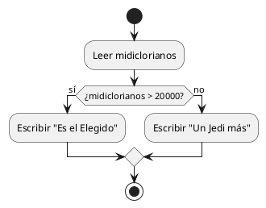
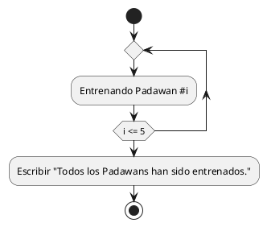
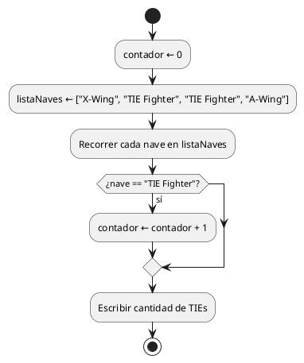
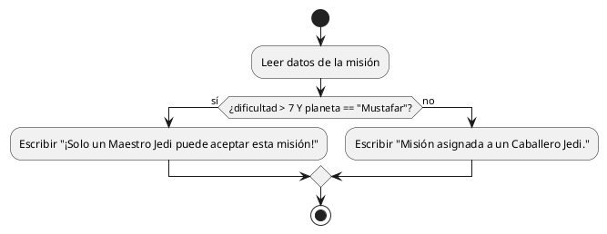
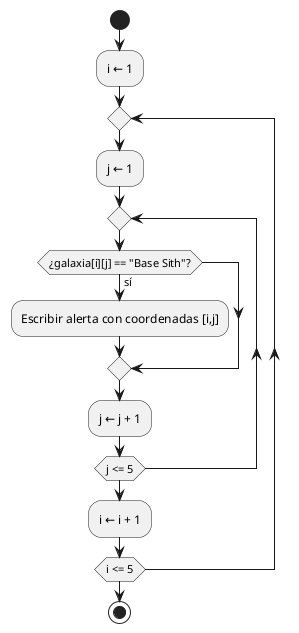

## 🌟 EJEMPLOS CLÁSICOS DE PSEUDOCÓDIGO EN PLANTUML

### 🔰 1. **Es el Elegido** (if simple)

---

### 🧪 2. **Entrenar Padawans** (bucle `PARA`)

---

### ⚔️ 3. **Contar cazas TIE** (lista + contador)

---

### 🧠 4. **Evaluar misión peligrosa**

---

### 🌌 5. **Escanear la Galaxia (matriz 5x5)**

---

### ✅ Cómo usar estos diagramas

Puedes:

* Pegarlos en [https://plantuml.com/es/activity-diagram-beta](https://plantuml.com/es/activity-diagram-beta)
* O usar [https://plantuml-online-editor.kkeisuke.dev/](https://plantuml-online-editor.kkeisuke.dev/)
* O integrarlos en VSCode con la extensión "PlantUML"

---
